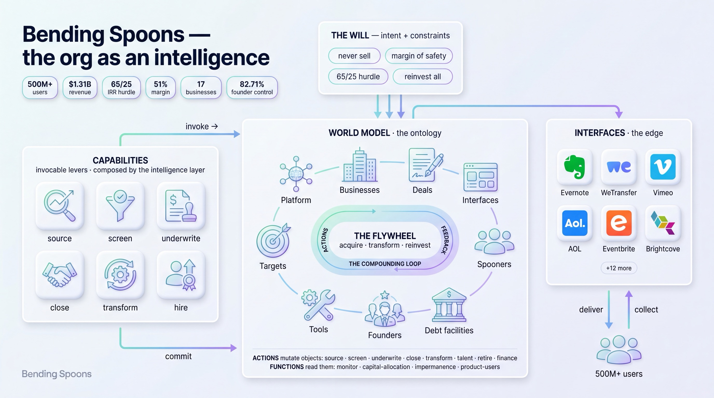

# Bending Spoons — a queryable world model



> **What this is** — a demonstrative exercise by **Play New**: a worked example of *how we model an organization* as a queryable ontology + intelligence. The subject is Bending Spoons, built **only from its public filings** (Form F-1, Jun 2026; 424B4, Jul 2026) **as of those dates** — a **point-in-time snapshot, not a maintained or live product**, and **not affiliated with or endorsed by Bending Spoons**. The method is the point; Bending Spoons is the example.

## TL;DR — what is this, and what can I do with it?
Bending Spoons acquires proven digital products (Evernote, WeTransfer, Vimeo, AOL…), transforms and operates them, and reinvests the earnings into the next acquisition — an operating *machine*, not a portfolio of apps. **This repo is a queryable model of how that machine works** — built only from official documents — **plus the machine's own moves as tools you can run.**

### Connect it to Claude — step by step (no coding needed)
You do this once; it takes a few minutes. Never set up an MCP server before? Follow all five steps.

**1 · Get the code onto your computer.** With git:
```bash
git clone https://github.com/Play-New/bending-spoons-ontology.git
cd bending-spoons-ontology
```
No git? On the GitHub page click the green **Code** button → **Download ZIP**, unzip it, and open a terminal in that folder.

**2 · Make sure you have Python 3.10+.** Check with `python3 --version`. If it's missing, install it from [python.org](https://www.python.org/downloads/) (tick "Add Python to PATH" on Windows).

**3 · Install the three small dependencies** (from inside the folder):
```bash
python3 -m pip install -r mcp/requirements.txt
```

**4 · Tell Claude where the server is.** Pick your app:

- **Claude Code** (the terminal tool) — one command, from inside the folder:
  ```bash
  claude mcp add bending-spoons-ontology -e RADAR_CONTACT=you@example.com -- python3 "$(pwd)/mcp/server.py"
  ```
  (`$(pwd)` fills in the full path for you.) Done — start `claude` and ask.

- **Claude Desktop** (the Mac/Windows app):
  1. First get the folder's full path: run `pwd` in the terminal (you're inside the folder) and copy what it prints.
  2. In the app open **Settings → Developer → Edit Config** — this opens the file `claude_desktop_config.json` in your editor.
  3. Paste the block below inside it, replacing the path with the one from step 1. **If the file already has an `"mcpServers"` section, add just the `"bending-spoons-ontology": { … }` part inside it** (don't create a second `mcpServers`):
     ```json
     {
       "mcpServers": {
         "bending-spoons-ontology": {
           "command": "python3",
           "args": ["/PASTE/YOUR/PATH/HERE/bending-spoons-ontology/mcp/server.py"],
           "env": { "RADAR_CONTACT": "you@example.com" }
         }
       }
     }
     ```
  4. **Save the file, then fully quit and reopen Claude Desktop** (not just close the window). A 🔨 tools icon appears when it's connected.

> **What's `RADAR_CONTACT`?** Put your email there. The model tools — query, capabilities, hire, audit — work **without** it; only the *live* ⚡ radar tools that scout **SEC EDGAR** need it, because EDGAR requires a declared contact in every request and returns **403** otherwise. Not scouting live US data? Leave the placeholder; everything else still works.

**5 · Check it worked.** Ask Claude: *"What Bending Spoons tools do you have?"* — it should list ~27. Stuck? The most common cause is a wrong path in step 4 — make sure it's the **absolute** path (starts with `/` on Mac/Linux, `C:\` on Windows) and points to `mcp/server.py`.

Once connected, just ask, in plain language:

- **Understand it** — *"Show me Bending Spoons' portfolio and how they transformed each business."* · *"How do they decide what to acquire, and what do they pay?"* · *"How does the acquisition flywheel work?"*
- **Scout like they do** — *"Find EU-listed companies with $50M–$5B revenue I could acquire."* · *"Check the gates for Sonos and Pinterest."* · *"How strong is Evernote's brand right now?"*
- **Run the deal machine** — *"Screen this target, then underwrite it against the 65/25 hurdle and show me the walk-away price."* It **proposes**; you **approve** the write (the human gate is built in — nothing is written without your yes).
- **Hire like they do** — *"Draft an advisory assessment of this candidate against Bending Spoons' published hiring gates."* (decision-support only — a human decides; candidate scoring is high-risk under the EU AI Act, so it recommends and stops, it never picks)

**More questions to try** — a full, tested bank (grouped by intent, one per tool, heavy on the capabilities) is in [`docs/try-it.md`](docs/try-it.md).

Two rules make it trustworthy: **every fact is cited to an official document** (fact vs. thesis is never blurred), and **nothing changes the model without a human approving it.** It is not a slide deck — it is a runnable model with guardrails. The rest of this README is the how and the why.

---

## One model, one analysis

A rigorous, public world model of Bending Spoons — a case study of an AI-native operating model — built only from official sources: the public F-1 and IPO record, and Bending Spoons' own published documents. It is a **world model** you can query, plus **capabilities as invocable skills**: the same engine, not an analysis handed to you.

The repo separates two things that must never blur:
- **the model, at the root** (`ontology.md` · `world-model/` · `capabilities/` · `interfaces/`) — Bending Spoons as the filings show it today — the acquisition machine, products-as-assets, the capital-flywheel. Every node in it is `status: confirmed`, cited to the line — except the one declared gap (`status: proposed`).
- **`bending-spoons-as-an-intelligence.md`** — **the analysis**: the repo's one argued thesis — how the same subject would reorganize if the value migrates from products to knowledge (the graph, the unbundling, the knowledge-flywheel). `status: proposed`, an essay by design: a thesis in essay form cannot be mistaken for a fact in model form.

The model states; the analysis argues. What connects them is the gap the model itself declares (`world-model/customer/cross-product-graph.md`).

## The reading

**The work.** Bending Spoons went public in 2026; its F-1 and 424B4 are among the most detailed public descriptions of an AI-native acquisition machine that exist. This repo turns that corpus into something you can *interrogate* rather than just read: a typed world model (objects, properties, links), its operating verbs as runnable capabilities behind human gates, and an MCP server that serves both. Every fact is anchored to a line in an official source (the filings, or Bending Spoons' own published docs); every inference is marked; a runnable audit refuses to let the two blur. Two readings of the same company come out of it — one the record proves, one the repo argues — and the discipline is to keep them visibly apart.

**Bending Spoons as it is — the model.** Bending Spoons is a machine for buying mature digital businesses and running them for cash. It acquires proven consumer/prosumer products — often past their growth peak, undermonetized, with loyal bases (Evernote, WeTransfer, Vimeo, Eventbrite, Brightcove, komoot, AOL…) — at disciplined prices, then centralizes them on a shared Platform of proprietary technology and a small, durable core of operators. The economics compound: revenue $387M → $1.31B (FY2023→FY2025), adjusted operating margin 36% (FY2023) → 51% (Q1 2026), while the same acquisition hurdles (65% levered / 25% unlevered IRR) held as capital deployed scaled ~10×. It is financed by debt and retained cash — no dividends, everything reinvested — so GAAP net income sits near zero under the interest load, and net debt runs ~$3.6B. Products are treated as impermanent assets (100% → 24% of revenue in eight quarters); "never sell" is a strategy, not a charter law. Discipline is the moat: margin of safety, patience, no bid escalation, a ≤4.00 leverage covenant, and founder voting control (82.71%). This is the model at the root — every node `confirmed`, cited to the line.

**Bending Spoons as it could be — the analysis.** Read the same company not as a portfolio of products but as an *intelligence*: a world model of its assets and customers, a set of capabilities, an intelligence layer that composes them, and interfaces where people act. Seen that way, one thing is conspicuously missing. The 500M+ monthly users are a *sum of silos* — no unified account, no cross-product identity — so the customer signal that should feed sourcing and monetization is thrown away every turn of the flywheel. The thesis (`bending-spoons-as-an-intelligence.md`, `status: proposed`): as AI commoditizes building and operating products — the very edge the machine sells — the durable asset stops being any product and becomes the **unified, per-person knowledge no single product can hold**. The will does not change; the thing being compounded shifts from *capital across businesses* to *knowledge across people*, and the capital-flywheel's leak becomes a knowledge-flywheel. The F-1 shows no plan to do this — which is exactly why it lives in one declared essay, not a second model.

## Where this is going — the agentic org
The end state this model is built for is not a document you read but an **organization that can run**: press play and the machine sources, screens, underwrites, closes, transforms, hires, and finances — each step a human-gated action over the world model, executed through the two-phase engine (`mcp/engine.py`). The **agentified capabilities** are the body; the **feedback loops** are the nervous system that lets it learn.

A capability that only executes is a tool; a capability whose **outcomes feed back to improve it** is an intelligence. Every turn of the flywheel (`ontology.md §3`, loop ②) is meant to close:
- every **target → deal → business** teaches which signals predict a strong business → recalibrates sourcing and underwriting;
- every **business that grows** teaches which transformation levers worked → refines the playbook;
- every **hire who succeeds** teaches which selection signals predicted performance → sharpens the gates (Bending Spoons' own "hiring as a science", `sources/hiring/`).

Mechanically, each loop is an **outcome reading** (a function: realized-vs-expected) feeding a **calibrate step** (adjusting the capability's own parameters — the thesis, the priors, the playbook, the gates). That write-back closing the loop is what *would* turn loop ② from a diagram into a running mechanism, and make the org *self-improving* rather than merely repeatable. This is the **direction**, marked `[decision]`, not a built engine verb: it is modeled from Bending Spoons' observed outcome-informed discipline (the 65/25 IRR hurdles held stable across a ~10× scaling of deployed capital, `bsp-f1` ~L110-111/~L334; the talent process run as a science, `sources/hiring/`), and a genuinely data-driven calibration needs *longitudinal* outcome data a single-snapshot filing does not yet disclose. What is real today: the outcome-reading side (`monitor` reads held businesses vs their underwriting; `retire` consumes its drift finding). The calibrate-back-to-sourcing side is the specified next turn, and it points at the customer-signal loop the analysis argues — the **knowledge-flywheel** (`bending-spoons-as-an-intelligence.md §5`). This is the north star; the repo builds toward it capability by capability, each behind its gate.

## Layout
```
bending-spoons-ontology/
├── README.md         this
├── CLAUDE.md         the modeling discipline (governing rules) + status
├── foundations/      the two contracts — ontology.md (structure) · org-as-an-intelligence.md (organization)
├── will.md           the volere (SHARED): problem → mission → intent → constraints + governance
├── AGENTS.md         the intelligence layer: how the model composes capabilities into action
├── sources/          immutable captures (SHARED): the F-1 (bsp-f1) + 424B4 (bsp-424b4) filings · Bending Spoons' own docs (hiring/) · press (non-fact)
├── mcp/              the Ontology SDK: server.py (27 tools — query · two-phase engine · radar · hire · audit) · audit.py + audit-contract.md (the model's service tools)
├── bending-spoons-as-an-intelligence.md   THE ANALYSIS (proposed): the value-migration thesis, in essay form
│
├── ontology.md       THE MODEL's index (confirmed): §1 objects · §2 actions & functions · §3 flywheel
├── world-model/      OBJECTS (+ labelled backing datasets)
│   ├── company/          platform · tools/(×5) · spooners · founders · deal · facility · businesses/(×17) + the backing csvs
│   └── customer/         market-of-targets (Target) + targets.csv · cross-product-graph (the gap)
├── capabilities/     KINETIC — actions/ (source·screen·underwrite·close·transform·talent·retire·finance) · functions/ (monitor·the readings)
└── interfaces/       Interface ×18, one node each (+ interfaces.csv): the app the user touches, of→Business
```

## The method — reapplicable
This repo is one instance of a **reusable pipeline**: everything in `foundations/` (the two contracts, the seven-field action contract, the three-field function contract, the eleven audit invariants) is org-independent; everything else is the per-subject content it produced from one corpus. To model another subject, keep the engine, change the fuel:

```
0. sources/       capture the corpus — immutable, line-addressable (~L)
1. foundations/   the TWO contracts (fixed): structure (the ontology grammar) · organization (the org as an intelligence)
2. will.md        read who the subject is: problem → mission → intent → constraints
3. ontology.md    declare the schema: §1 objects+properties+links · §2 actions+functions   [only the human amends]
4. world-model/   fill: nodes + backing datasets 1:1, every fact with provenance + markers + the
                  two clocks (as_of = period of the data · last_synced = last verified vs sources)
5. capabilities/  contract the verbs (7 fields) and the readings (3 fields)
6. audit          enforce the invariants; every defect found by hand becomes a standing check
7. interfaces     expose: MCP — nodes via read-only query tools, actions behind the gates
8. analysis       (optional) argue the subject's next shape — as a declared essay, never a second model
```

The running system stacks like the layer diagram it is modeled on — data at the bottom, security wrapped around it, the ontology as the plane humans and agents actually work on:

```
        humans + agents  (Claude, MCP clients — judgment at the edge)
   ────────────────────────────────────────────────────────────────
        THE ONTOLOGY PLANE      world-model + capabilities + interfaces (moved by will.md) + the analysis
   ────────────────────────────────────────────────────────────────
        SECURITY                provenance (~L) · markers · the will's gates   (foundations/ontology.md §6)
   ────────────────────────────────────────────────────────────────
        DATA                    sources/  (the immutable filings)
```
The MCP server (`mcp/`) is this repo's Ontology SDK: the door through which the top layer reaches the plane.

## Where to start
Read `CLAUDE.md` for the modeling discipline and `foundations/` for the two contracts it rests on (the ontology grammar; the org-as-an-intelligence model). Then `will.md` (the shared volition) and `AGENTS.md` (how it acts). Then `ontology.md` → `world-model/` → `capabilities/` for the model as it is, and `bending-spoons-as-an-intelligence.md` for the analysis of where it could go — and why that is an essay, not a second model.

## Sourcing discipline (why it is publishable)
Facts come from **official sources** only, in two tiers (CLAUDE.md rule 8), each captured under `sources/`:
1. **The SEC filings** — the primary record: filing facts cite `bsp-f1` (the Form F-1) with a `~L` line reference against the full-text capture; **IPO-pricing facts cite `bsp-424b4`** (the final 424B4 prospectus) with a `~L` ref — the offer price $29.00/share, the share counts, and net proceeds all live there.
2. **Bending Spoons' own published documents** — company-authored primaries for what only they document, cited by id (e.g. `bsp-selection-process`, `bsp-talent-formula` in `sources/hiring/`, which ground the `hire` capability's selection gates). Captured as facts + short fair-use quotes, never verbatim (they are copyrighted). A few interface brand/feature facts carry a third, weaker provenance — `official-site` (a live company page, cited by URL, not line-addressable) — honestly tagged and never load-bearing for a model-critical figure.

The transformation theory lives in one declared analysis file (`bending-spoons-as-an-intelligence.md`), the system's own thesis, never asserted as a fact about BS. **Third-party press is never a fact source**: the press captures (`ipo-2026-07`, `press-turnaround`) are not sources about Bending Spoons — `ipo-2026-07` is superseded for pricing by `bsp-424b4` and survives only for the first-day trading print. Anything no official source supports — the implied ~$18.4B valuation (mark `[derived]`, from price × shares), first-day trading, layoff percentages — is marked `[derived]`, `[to-validate — press only]`, or `status: proposed`, never asserted as fact. That discipline is what makes the case defensible in public.

## References
Influences — not sources of the Bending Spoons facts, which come only from the official sources above. The method rests on two, one per contract:
- **The ontology** — how the model is *structured* (object / property / link / action / function types; the digital twin): the **Palantir Foundry ontology**. → `foundations/ontology.md`.
- **The org as an intelligence** — how the subject is *organized* (world model · capabilities · intelligence layer · interfaces): **Jack Dorsey & Roelof Botha, *"From Hierarchy to Intelligence"*** (Block + Sequoia, 2026). → `foundations/org-as-an-intelligence.md`.

The **will** — the intention and direction that sits above both — is this project's own addition.

## License
**MIT** (see [LICENSE](LICENSE)). It covers Play New's own software and its expression and arrangement of the model — **not** the underlying copyrighted sources. [NOTICE](NOTICE) states what that means: the facts come from Bending Spoons' public filings and its own documents, used with short fair-use quotes, and this repo is a **point-in-time snapshot by Play New, not maintained and not affiliated with Bending Spoons**. It is a demonstrative exercise, so it does not accept pull requests — see [CONTRIBUTING.md](CONTRIBUTING.md) (issues welcome; fork freely).
